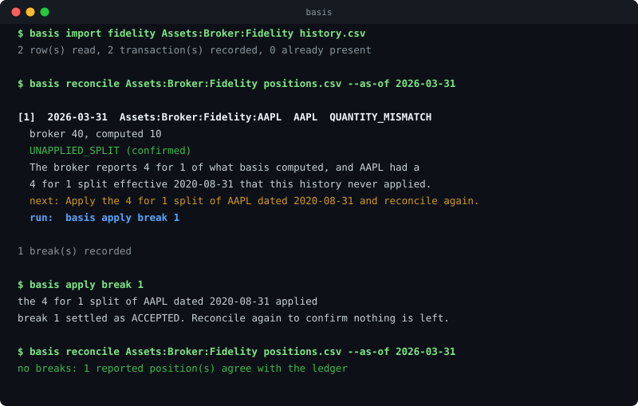
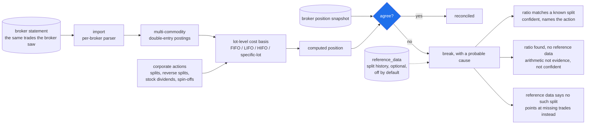

# basis

**A ledger that argues with your broker.**

[](https://github.com/lgoyal6/basis/actions/workflows/test.yml)
[](https://adoptium.net/)
[](https://www.postgresql.org/)
[](LICENSE)

Given the same trades your broker saw, `basis` replays them through a multi-commodity
double-entry ledger, applies corporate actions, computes lot-level cost basis, and then
compares its answer against the position the broker itself reports. Every disagreement
becomes a **break** with a probable cause attached.

Instead of "you have 30 fewer shares than expected", you get this:



That is real output, and the split history behind it is real: Apple did split 4 for 1 on
2020-08-31.

## Try it

One command, no API key, no data of your own. It builds a history that never applied a
split, asks a broker snapshot whether that history is right, and lets basis explain the
difference:

```bash
git clone https://github.com/lgoyal6/basis && cd basis
./scripts/demo.sh
```

Needs JDK 21 and Docker, and tears the database down when it finishes. It walks the whole
loop: import, reconcile, find the ratio, refuse to call it a split without evidence, record
the split, reconcile again, apply the fix, confirm nothing is left, then throw the derived
state away and replay it from the postings.

## Contents

- [Try it](#try-it)
- [What it refuses to do](#what-it-refuses-to-do)
- [Quickstart](#quickstart)
- [How reconciliation works](#how-reconciliation-works)
- [What a break looks like](#what-a-break-looks-like)
- [Market data](#market-data)
- [Commands](#commands)
- [Adding your broker](#adding-your-broker)
- [Getting your transaction history](#getting-your-transaction-history)
- [Deploying it](#deploying-it)
- [Building from source](#building-from-source)
- [Status](#status)
- [Contributing](#contributing)
- [License](#license)

## What it refuses to do

- It is not a tax product. It does not generate tax forms.
- It does not guess. Ambiguous corporate actions raise a break and ask.
- It never touches broker credentials. Statement upload only.

## Quickstart

Needs JDK 21 and Docker.

```bash
git clone https://github.com/lgoyal6/basis && cd basis

docker compose up -d          # Postgres 16, which is all it depends on
./gradlew bootJar

export BASIS_DB_URL=jdbc:postgresql://localhost:5432/basis
export BASIS_DB_USER=basis BASIS_DB_PASSWORD=basis
# a function, not basis="java -jar ...". zsh does not word-split an unquoted
# variable, so the string form works in bash and silently fails on a stock Mac.
basis() { java -jar build/libs/basis.jar "$@"; }

# what you held before your oldest statement. a Fidelity download covers 90 days,
# so a sale in it whose purchase is older needs this first
basis open Assets:Broker:Fidelity AAPL 100 --cost 90.00 --on 2015-03-12

basis import fidelity Assets:Broker:Fidelity history.csv    # the statements
basis reconcile Assets:Broker:Fidelity positions.csv --as-of 2026-03-31
```

If basis and your broker disagree, the last command prints each break, what it thinks
caused it, and the exact command to act on it. Run that, then reconcile again to confirm
nothing is left.

Exit codes: `0` ok, `1` failed, `2` bad usage, `3` reconcile found breaks. The last one is
deliberately not a failure, so a pipeline can act on a disagreement.

## How reconciliation works



Three answers, not two. A ratio that provably is not a corporate action is a
different finding from one that might be, and it gets its own code rather than
being folded into a guess.

Eight invariants are asserted over generated histories after every step, which is
what stops the ledger from drifting as new event types land.

## What a break looks like

There are three answers, not two, and the difference between them is the point of the
project. The image above is the first: a ratio found *and* confirmed against real split
history, confident enough to offer you the command.

The second is the same arithmetic without the evidence. basis says so rather than
guessing:

```
[1]  2026-03-31  Assets:Broker:Fidelity:AAPL  AAPL  QUANTITY_MISMATCH
  broker 40, computed 10
  UNAPPLIED_SPLIT (suspected)
  The broker reports 4 for 1 of what basis computed, which is the shape of an
  unapplied split. The split history for AAPL cannot confirm or rule that out
  because it has never been fetched, so this is arithmetic and not evidence.
  next: Refresh the reference data for AAPL and reconcile again.
```

The third is the one most tools get wrong. The split history *was* fetched, and it
contains no such split, so a ratio that looks like a corporate action provably is not
one. That is a different finding and gets its own code, pointing at missing trades
instead:

```
[2]  2026-03-31  Assets:Broker:Fidelity:AAPL  AAPL  QUANTITY_MISMATCH
  broker 30, computed 10
  RATIO_WITHOUT_KNOWN_SPLIT (suspected)
  The broker reports 3 for 1 of what basis computed, which is the shape of an
  unapplied split, but the split history for AAPL was confirmed and contains no
  such split between 2020-01-03 and 2026-03-31. The ratio is a coincidence.
  next: Treat this as missing trades rather than a corporate action, and look for
  activity the imported history does not contain.
```

"Checked and found nothing", "never checked" and "could not check" are three different
states, and collapsing them into one is how a tool ends up confidently wrong.

## Market data

Split history comes from Financial Modeling Prep and is cached in `reference_data`.
It is off by default and touches the network only when switched on.

You do not need it. A provider is one source of evidence, not the only one, and it can be
wrong or paywall the symbol you care about. `basis cache-split DEMO 4:1 --on 2020-08-31`
records a split by hand from a broker notice, and `status` shows which facts came from a
provider and which somebody typed.

To use the provider anyway:

```
set -a; source .env; set +a          # Spring does not read .env itself
BASIS_FMP_ENABLED=true ./gradlew ... # or set basis.fmp.enabled
```

Two tests call the provider for real and are excluded from every default run. Run
them with `./gradlew test -PwithNetwork` and a key in the environment.

See `docs/FEASIBILITY.md` for the week 0 feasibility gate and
`docs/ARCHITECTURE.md` for every design decision and why it was taken.

## Commands

```
basis --help
```

| Command | What it does |
| --- | --- |
| `import <broker> <account> <file.csv>` | read a broker statement into the ledger |
| `open <account> <symbol> <qty> --cost P --on DATE` | state what was held before the history begins |
| `reconcile <account> <positions.csv> --as-of DATE` | compare against the broker and record breaks |
| `breaks <account>` | every open break, with its probable cause and id |
| `apply break <id>` | do what a confirmed break said to do, then settle it |
| `settle <id> --accept\|--reject\|--resolved` | record a human's judgement on a break |
| `status` | positions, derived state, open breaks, reference data freshness |
| `refresh-splits [SYMBOL...]` | fetch split history for symbols that need it |
| `cache-split <symbol> <new:old> --on DATE` | record a split by hand, no provider needed |
| `rebuild` | truncate derived state and replay it from the postings |
| `recover` | resolve an import batch that was interrupted |

Corporate actions are entered rather than parsed, because transaction exports report them
inconsistently and a split read wrongly restates every lot in a position:

```
basis apply split          <account> AAPL 4:1 --on 2020-08-31
basis apply reverse-split  <account> XYZ 1:8 --on 2026-02-20 --cash-in-lieu 12.34
basis apply stock-dividend <account> KO 2.5 --on 2026-03-01
basis apply spin-off       <account> PARENT CHILD 0.5 0.30 --on 2026-04-01
basis apply average-cost   <account> VTSAX --on 2026-01-01   # funds only
```

Running any of them twice is a no op, so a nervous second attempt is safe.

## Adding your broker

No broker is named anywhere in the Java. A broker is a properties file in
`config/brokers/`, and `fidelity.properties` and `schwab.properties` ship as
starting points:

```properties
profile.name = Fidelity
date.formats = MM/dd/yyyy | M/d/yyyy
column.date   = Run Date | Date | Trade Date
column.action = Action | Transaction Type
column.amount = Amount | Net Amount
action.BUY    = YOU BOUGHT | BOUGHT | PURCHASE
action.SELL   = YOU SOLD | SOLD
```

Column matching ignores case and anything in parentheses, so `Price ($)` matches
`Price`. Actions match by longest prefix, since the real text runs on past the verb
(`YOU BOUGHT PROSHARES ULTRAPRO QQQ`).

The Fidelity profile has been corrected against a real Accounts History export and
imports it exactly. The Schwab one has not, and is still a guess. A row basis cannot
read stops the import and prints the exact wording it did not recognise, which is how
you find out what to add.

Instrument kinds are declared in `config/commodities.csv`, because no statement says
whether a ticker is a mutual fund and US rules only permit average cost basis for
one. Anything undeclared is an ordinary equity.

## Getting your transaction history

**Fidelity**: log in, select the account, `Activity & Orders`, `History`, set a date
range, `Apply`, then `Download`. Each download is capped at 90 days and about 5 years
are available, so a full history is several files. Importing overlapping files is
safe: rows already in the ledger are skipped.

The position snapshot for `reconcile` is basis's own format, not a broker's:

```
symbol,quantity,cost_basis,kind
AAPL,40,,EQUITY
MSFT,10,3000.00,EQUITY
USD,1520.55,,CURRENCY      # only with --with-cash
```

`cost_basis` is optional, because most statements report a quantity and a market
value and nothing else. Whether the file covers cash is stated with `--with-cash`
rather than guessed, because an omitted cash line means "the statement did not say"
on most reports and "the balance is zero" on some.

Ticker renames live in `config/symbol-changes.csv`, maintained by hand because the
provider's symbol change endpoint is paywalled.

## Deploying it

basis is a command line tool, not a service. There is no web layer and nothing listens on
a port. "Deploying" means putting a jar somewhere with a JDK 21 and pointing it at a
Postgres 16.

**A tagged release** builds the jar in CI and publishes it with a checksum:

```bash
git tag v0.1.0 && git push origin v0.1.0
```

**Configuration is environment only.** Nothing secret is ever committed or logged:

| Variable | Default | |
| --- | --- | --- |
| `BASIS_DB_URL` | `jdbc:postgresql://localhost:5432/basis` | |
| `BASIS_DB_USER` | `basis` | |
| `BASIS_DB_PASSWORD` | `basis` | change this |
| `BASIS_FMP_ENABLED` | `false` | market data, off unless asked |
| `FMP_KEY` | none | only read when the above is true |

**Migrations run themselves** at startup through Flyway. `clean` is disabled and cannot be
enabled by configuration: the whole point of an append-only posting table is that it cannot
be thrown away by accident.

**Scheduling it** is a cron entry and an exit code. `reconcile` exits `3` when it finds
breaks, which is deliberately not a failure, so this reports disagreements without the job
itself going red:

```bash
0 6 * * 1  basis reconcile Assets:Broker:Fidelity /data/positions.csv \
             --as-of "$(date +%F)" || [ $? -eq 3 ]
```

**If it dies mid-import**, the batch is left with a null `committed_at`, which is a crash
marker rather than a state anyone has to reason about. Run `recover` and import the file
again. Imports are idempotent, so re-importing overlapping files is always safe.

## Building from source

Needs JDK 21 and Docker (Testcontainers spins up Postgres 16 for the persistence
tests).

```
JAVA_HOME=/path/to/jdk-21 ./gradlew test
```

Testcontainers starts a real Postgres 16 for the persistence tests, which is why Docker is
required rather than suggested.

## Status

Working end to end and used against a real Fidelity export. Not packaged for anyone else
yet: no release has been cut, and it has been run by one person on one broker.

What is built:

- Multi-commodity double-entry postings, lot-level cost basis, and FIFO / LIFO / HIFO /
  specific-lot selection, with average cost as an election restricted to funds
- Buys, sells, fees, opening balances, cash dividends and interest with withholding, and
  transfers that carry their lots so the holding period does not restart
- Splits, reverse splits, stock dividends and spin-offs, which restate a position without
  changing what it is worth, and cash in lieu for the fraction a reverse split leaves
- Reconciliation producing breaks with a probable cause, and `apply break` to act on one
- A statement importer driven by per-broker config files, validated against a real export
- Eight invariants asserted over generated histories, including replay determinism

Known limits:

- `config/brokers/schwab.properties` has never met a real Schwab export. It ships as a
  demonstration that a broker costs a config file, not as a tested profile.
- Corporate actions are entered by hand. Only splits are looked up automatically.
- One currency per posting is supported, but nothing converts between currencies, so a
  genuinely multi-currency account will not reconcile.
- Ticker renames are maintained by hand in `config/symbol-changes.csv`, because the
  provider's symbol change endpoint is paywalled.

## Contributing

See [CONTRIBUTING.md](CONTRIBUTING.md). The short version: no `double` or `float` anywhere,
the posting table is append-only, nothing guesses, and if a design decision is ambiguous it
gets written into [docs/ARCHITECTURE.md](docs/ARCHITECTURE.md) with the options and the
reason rather than being made silently.

## License

MIT
