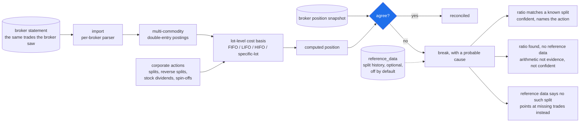

# basis

Independently recomputes brokerage positions from transaction history and reports every disagreement with the broker.

Given the same trades a broker saw, `basis` replays them through a multi-commodity double-entry ledger, applies corporate actions, computes lot-level cost basis, and then compares its answer against the position the broker itself reports. Every disagreement becomes a **break** with a probable cause attached.

Instead of "you have 30 fewer shares than expected", you get "that is a 4-to-1 ratio, there is an unapplied split on this date, apply it?"

## What it refuses to do

- It is not a tax product. It does not generate tax forms.
- It does not guess. Ambiguous corporate actions raise a break and ask.
- It never touches broker credentials. Statement upload only.

## Status

Week 4. Ledger core, distributions, transfers, corporate actions, reconciliation.

- Multi-commodity double-entry postings, lot-level cost basis, and
  FIFO/LIFO/HIFO/specific-lot selection
- Buys, sells, fees, opening balances, cash dividends with withholding, and
  transfers that carry their lots so the holding period does not restart
- Splits, reverse splits, stock dividends and spin offs, which restate a position
  without changing what it is worth
- All eight invariants, asserted over generated histories after every step

- Reconciliation against a broker position snapshot, producing breaks with a
  probable cause attached

- A market data client that populates the split cache, so most split-shaped breaks
  explain themselves

- A statement importer driven by per-broker config files, so a new broker costs a
  properties file rather than code

- Commands to enter corporate actions and opening balances, and to apply a break's
  own suggestion

Every event the ledger declares is handled and reachable, and the Fidelity importer
has been validated against a real export. No web layer.

### How reconciliation works



Three answers, not two. A ratio that provably is not a corporate action is a
different finding from one that might be, and it gets its own code rather than
being folded into a guess.

Eight invariants are asserted over generated histories after every step, which is
what stops the ledger from drifting as new event types land.

### What a break looks like

Given a history that never applied Apple's 2020 split, and a statement saying 40
shares where basis computed 10:

```
2026-03-31 Assets:Broker:IBKR:AAPL AAPL QUANTITY_MISMATCH: broker 40, computed 10.
The broker reports 4 for 1 of what basis computed, and AAPL had a 4 for 1 split
effective 2026-02-20 that this history never applied.
Apply the 4 for 1 split of AAPL dated 2026-02-20 and reconcile again.
```

Without reference data the same break still finds the ratio, says so is arithmetic
rather than evidence, and is marked not confident. basis does not guess.

There are three answers, not two. If the split history was fetched and contains no
such split, the break says so and points at missing trades instead: a ratio that
provably is not a corporate action is a different finding, and it gets its own code.

### Market data

Split history comes from Financial Modeling Prep and is cached in `reference_data`.
It is off by default and touches the network only when switched on:

```
set -a; source .env; set +a          # Spring does not read .env itself
BASIS_FMP_ENABLED=true ./gradlew ... # or set basis.fmp.enabled
```

Two tests call the provider for real and are excluded from every default run. Run
them with `./gradlew test -PwithNetwork` and a key in the environment.

See `docs/FEASIBILITY.md` for the week 0 feasibility gate and
`docs/ARCHITECTURE.md` for every design decision and why it was taken.

### Running it

Needs JDK 21 and a Postgres 16. Build a jar and ask it what it does:

```
./gradlew bootJar
java -jar build/libs/basis.jar --help
```

Import a statement, then reconcile a position snapshot against it:

```
export BASIS_DB_URL=jdbc:postgresql://localhost:5432/basis
export BASIS_DB_USER=basis BASIS_DB_PASSWORD=basis

basis="java -jar build/libs/basis.jar"

# what you held before your oldest statement. a Fidelity download covers 90 days,
# so a sale in it whose purchase is older needs this first
$basis open Assets:Broker:Fidelity AAPL 100 --cost 90.00 --on 2015-03-12

# the statements themselves
$basis import fidelity Assets:Broker:Fidelity history.csv

# what the broker says you hold now
$basis reconcile Assets:Broker:Fidelity positions.csv --as-of 2026-03-31

# basis finds a 4 for 1 ratio, confirms it against the split history, and says
# which split you never applied. do what it said, then check nothing is left:
$basis apply break 1
$basis reconcile Assets:Broker:Fidelity positions.csv --as-of 2026-03-31
```

Exit codes: `0` ok, `1` failed, `2` bad usage, `3` reconcile found breaks. The last
one is deliberately not a failure, so a pipeline can act on a disagreement.

Corporate actions are entered rather than parsed, because transaction exports report
them inconsistently and a split read wrongly restates every lot in a position:

```
basis apply split         <account> AAPL 4:1 --on 2020-08-31
basis apply reverse-split <account> XYZ 1:8 --on 2026-02-20 --cash-in-lieu 12.34
basis apply stock-dividend <account> KO 2.5 --on 2026-03-01
basis apply spin-off      <account> PARENT CHILD 0.5 0.30 --on 2026-04-01
basis apply average-cost  <account> VTSAX --on 2026-01-01   # funds only
```

Running any of them twice is a no op, so a nervous second attempt is safe.

### Adding your broker

No broker is named anywhere in the Java. A broker is a properties file in
`config/brokers/`, and `fidelity.properties` and `schwab.properties` ship as
starting points:

```properties
profile.name = Fidelity
date.formats = MM/dd/yyyy | M/d/yyyy
column.date   = Run Date | Date | Trade Date
column.action = Action | Transaction Type
column.amount = Amount | Net Amount
action.BUY    = YOU BOUGHT | BOUGHT | PURCHASE
action.SELL   = YOU SOLD | SOLD
```

Column matching ignores case and anything in parentheses, so `Price ($)` matches
`Price`. Actions match by longest prefix, since the real text runs on past the verb
(`YOU BOUGHT PROSHARES ULTRAPRO QQQ`).

The Fidelity profile has been corrected against a real Accounts History export and
imports it exactly. The Schwab one has not, and is still a guess. A row basis cannot
read stops the import and prints the exact wording it did not recognise, which is how
you find out what to add.

Instrument kinds are declared in `config/commodities.csv`, because no statement says
whether a ticker is a mutual fund and US rules only permit average cost basis for
one. Anything undeclared is an ordinary equity.

### Getting your transaction history

**Fidelity**: log in, select the account, `Activity & Orders`, `History`, set a date
range, `Apply`, then `Download`. Each download is capped at 90 days and about 5 years
are available, so a full history is several files. Importing overlapping files is
safe: rows already in the ledger are skipped.

The position snapshot for `reconcile` is basis's own format, not a broker's:

```
symbol,quantity,cost_basis,kind
AAPL,40,,EQUITY
MSFT,10,3000.00,EQUITY
USD,1520.55,,CURRENCY      # only with --with-cash
```

`cost_basis` is optional, because most statements report a quantity and a market
value and nothing else. Whether the file covers cash is stated with `--with-cash`
rather than guessed, because an omitted cash line means "the statement did not say"
on most reports and "the balance is zero" on some.

Ticker renames live in `config/symbol-changes.csv`, maintained by hand because the
provider's symbol change endpoint is paywalled.

### Building

Needs JDK 21 and Docker (Testcontainers spins up Postgres 16 for the persistence
tests).

```
JAVA_HOME=/path/to/jdk-21 ./gradlew test
```

The suite is fully green. Invariant 8, corporate action value preservation, was a
deliberately failing placeholder through week 2 and is now a real property.

## License

MIT
